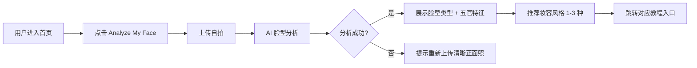
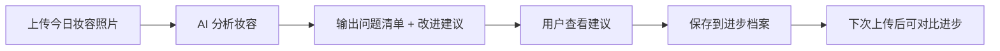

# BeautyFit 产品需求文档（全球版）

## 1. 文档信息

| 版本号 | 创建日期 | 负责人 | 状态 |
|--------|----------|--------|------|
| V1.0 | 2026-04-21 | — | 待评审 |

**产品名称：** BeautyFit
**Slogan：** Beauty that fits you.
**定位语：** Your AI makeup coach. Built for your face, not someone else's.

---

## 2. 名词解释

| 术语 | 解释 |
|------|------|
| Face Analysis | AI 通过分析用户上传的自拍，识别脸型轮廓和五官分布特征 |
| Makeup Recommendation | 基于 Face Analysis 结果，推荐适合用户脸型的妆容风格和修饰重点 |
| AI Makeup Coach | 付费核心功能，用户上传妆容照片后，AI 给出具体改进建议并追踪进步 |
| Starter Guides | 免费教程，包含妆容原理说明，不含具体手法图文步骤 |
| Step-by-Step Guides | 付费教程，包含步骤配图和具体化妆手法 |
| Custom Look Plan | 付费功能，根据用户脸型 + 场合 + 风格偏好生成个性化完整妆容方案 |
| Creative Community | 用户分享妆容作品、探索创意妆容灵感的社区功能 |
| Look Generator | 用户通过文字描述（prompt）生成创意妆容灵感图 |

---

## 3. 产品概述

### 3.1 产品背景

#### 市场现状

全球美妆市场规模超过 5000 亿美元，数字美妆工具需求快速增长。YouTube、TikTok、Instagram 上的美妆内容是全球最高热度品类之一。然而，现有产品存在明显痛点：

- **AR 试妆工具（如 Perfect Corp、L'Oréal ModiFace）**：以"看效果"为核心，默认添加美颜滤镜，结果与现实落差大，无法帮助用户学会化妆。
- **内容平台（YouTube、TikTok、Instagram）**：内容丰富但高度碎片化，缺乏个性化，用户需要自行判断哪些内容适合自己的脸型。
- **品牌 App**：以产品销售为核心，推荐可信度受商业利益影响。

#### 问题与机会

全球用户面临共同的核心问题：**现有工具告诉你"用什么产品"，却没有人告诉你"为什么这样画、你的脸适合什么"。**

更关键的是，全球美妆内容长期以欧美面孔为主导标准。亚洲、南亚、拉丁裔、中东等群体的用户长期处于被忽视的状态——她们的脸型、肤色、五官特征与这些"默认标准"有显著差异。这是一个尚未被认真对待的巨大市场机会。

BeautyFit 的核心主张：**为每一张脸提供真正匹配的美妆指导，不是把所有人套进同一个模板。**

#### 为什么是现在

"真实感"审美趋势在全球范围内崛起（#NoFilter、#RealBeauty 等话题持续高热），用户越来越不信任过度滤镜和美颜效果。BeautyFit 以"真实推荐，无美颜"为切入点，与这一全球趋势高度契合。

### 3.2 产品目标

**业务目标：**
- MVP 上线后 1 个月内，验证 Face Analysis 功能对全球用户的留存吸引力
- 上线后 3 个月内，验证付费订阅在英语市场的转化可行性（优先美国、英国、澳大利亚、新加坡）
- 以订阅收入为主要变现方式，不依赖广告或品牌导购

**用户目标：**
- 让用户在 5 分钟内得到"适合自己脸型的妆容方向"
- 让付费用户在 1 个月内感受到妆容技术的明显进步
- 让来自不同文化背景的用户都感受到"这是为我设计的，不只是为欧美用户"

### 3.3 目标用户

**主要用户群：** 18-35 岁全球女性，英语为主要使用语言

**优先市场（Phase 1）：** 美国、英国、澳大利亚、新加坡、加拿大
- 这些市场拥有大量有付费习惯的用户，且亚裔群体比例高，对"非欧美标准"美妆内容有强烈需求

**用户类型：**

| 用户类型 | 特征 | 核心需求 |
|----------|------|----------|
| 化妆新手 | 有化妆意愿但无从下手，不知道什么适合自己 | 脸型分析、入门引导、基础教程 |
| 进阶用户 | 已会基础化妆，想找到适合自己的风格或提升技术 | 个性化推荐、AI 反馈、精进手法 |
| 多元背景用户 | 亚裔、南亚裔、拉丁裔等，对欧美标准美妆内容有距离感 | 贴近自身脸型和肤色的推荐 |

### 3.4 用户痛点

| 痛点 | 具体表现 |
|------|----------|
| 找不到适合自己脸型的妆容建议 | 照着 YouTube 博主学，但对方是双眼皮高鼻梁，画出来效果截然不同 |
| 进步慢，不知道哪里出了问题 | 画完妆感觉哪里不对，但说不清楚，也没有反馈渠道 |
| 美妆内容欧美中心化 | 大多数教程默认欧美面孔为标准，亚裔、深肤色用户缺乏代表性内容 |
| AR 试妆不真实 | 美颜滤镜效果好看但参考价值低，实际效果和展示差距大 |
| 推荐不可信 | 美妆 App 推荐的产品都是付费合作，并非真正适合用户的建议 |

---

## 4. 竞品分析

### 4.1 主要竞品对比

| 维度 | Perfect Corp / YouCam | L'Oréal ModiFace | Ipsy (订阅盒子) | BeautyFit |
|------|-----------------------|------------------|-----------------|-----------|
| 核心功能 | AR 试妆展示 | AR 试妆 + 产品推荐 | 个性化产品订阅 | AI 教妆 + 推荐 |
| 人群适配 | 泛全球（欧美为主） | 泛全球（欧美为主） | 美国为主 | 多元面孔，非欧美中心 |
| 内容深度 | 展示效果，无教学 | 无教学 | 无教学 | 原理 + 手法 + AI 反馈 |
| 推荐可信度 | 品牌合作导购 | 品牌导购 | 商业合作选品 | 订阅制，无导购利益 |
| 商业模式 | 品牌广告 | 品牌广告 | 产品销售订阅 | 用户订阅 |

### 4.2 差异化定位

BeautyFit 不在 AR 试妆技术上与 Perfect Corp 或 ModiFace 正面竞争，而是建立三个维度的差异：

1. **多元面孔，非欧美中心** — 推荐和教程覆盖亚洲、南亚、拉丁裔、中东等多种面孔特征，让更多用户感受到"这是为我设计的"
2. **教你"为什么"，不只教"怎么做"** — 每个建议都附带原理解释，用户真正理解后不再依赖 App
3. **无美颜，重真实** — 以真实效果为标准，建立区别于滤镜类产品的信任感

---

## 5. 功能需求

### 5.1 功能总览

| 功能 | 层级 | 优先级 |
|------|------|--------|
| Face Analysis + Makeup Recommendation | 免费（每月限次） | P0 MVP |
| Starter Guides（基础文字教程） | 免费 | P0 MVP |
| 用户账号系统 | 免费 | P0 MVP |
| Step-by-Step Guides（图文详细教程） | 付费 | P1 |
| AI Makeup Coach（AI 教妆导师） | 付费 | P1 |
| Custom Look Plan（定制妆容方案） | 付费 | P1 |
| Creative Community（创意社群） | 免费（限次）+ 付费（无限） | P2 |
| Look Generator（Prompt 创意妆容） | 付费 | P2 |

---

### 5.2 Face Analysis + Makeup Recommendation（P0）

#### 功能概述
用户上传自拍，AI 识别脸型和五官分布，输出适合的妆容风格推荐及修饰重点。这是产品的核心入口，是用户对产品价值的第一感知。

#### 用户场景

**场景：韩裔美国用户 Jamie**
- 背景：25岁，单眼皮，跟着美妆博主学了很多，但效果一直不对
- 行为：上传自拍 → AI 分析 → 看到"你是心形脸+单眼皮，以下妆容方向更能突出你的优势" → 推荐 3 种适合的妆容风格
- 期望结果：第一次感受到"有人真的理解我的脸"

#### 功能流程

#### 详细说明

- **输入要求：** 正面自拍，光线充足，无遮挡
- **分析输出：**
  - 脸型类型（Oval / Round / Square / Heart / Oblong）
  - 五官特征标注（单/双眼皮、鼻梁高度、唇形等）
  - 推荐妆容风格 1-3 种，每种附带简短说明和修饰原理
  - 语言：英文输出
- **免费限制：** 每月可使用 3 次，超出后提示升级

#### 异常场景

| 异常情况 | 处理方式 | 用户提示 |
|----------|----------|----------|
| 照片模糊/侧脸 | 拒绝分析 | "Please upload a clear, front-facing photo with good lighting." |
| 有遮挡（刘海、手等） | 提示后可选择继续或重拍 | "We detected some coverage on your face. Results may be less accurate." |
| 分析服务超时 | 重试一次，失败后报错 | "Something went wrong. Please try again in a moment." |
| 月次数用完 | 引导付费或等待 | "You've used your free analyses for this month. Upgrade to get unlimited access." |

---

### 5.3 Starter Guides（基础文字教程，P0）

#### 功能概述
按脸型、风格、场合分类的英文文字教程库。内容偏基础入门，包含妆容原理（为什么这个脸型要这样修饰），不含具体手法图文步骤（手法为付费内容）。

#### 内容结构（每篇）
- 适合人群（脸型 + 经验水平）
- 这款妆的核心理念和原理
- 需要重点修饰的部位及原因
- 推荐风格关键词（不涉及具体产品品牌）
- 付费图文版入口引导

#### 分类维度

| 维度 | 示例标签 |
|------|----------|
| 脸型 | Oval, Round, Square, Heart, Oblong |
| 风格 | Natural, Glam, Soft Korean, Bold, Minimal |
| 场合 | Everyday, Date Night, Office, Festive |
| 多元适配 | Monolid, Deep-set eyes, Fuller lips, High cheekbones |

#### MVP 内容量
上线时准备 20-30 篇教程，覆盖主要脸型 × 常见风格组合，并包含针对亚洲面孔的专属内容。

---

### 5.4 用户账号系统（P0）

#### 功能概述
基础用户体系，支持保存分析历史和教程收藏。

#### 登录方式（全球版）
- Google 登录
- Apple 登录
- 邮箱注册

（移除微信登录，以适配全球用户）

#### 功能范围（MVP）
- 账号注册 / 登录
- 查看历史 Face Analysis 记录
- 收藏教程
- 查看剩余免费次数

---

### 5.5 AI Makeup Coach（P1，付费核心）

#### 功能概述
用户上传当天完成的妆容照片，AI 分析具体存在的问题，给出可操作的改进建议，并记录历史进步轨迹。

#### 用户场景

**场景：进阶用户 Priya（印度裔，英国）**
- 背景：化妆两年，总觉得妆面有点重，但不知道怎么调整
- 行为：上传妆容照片 → AI 返回："Your contour is sitting slightly too low. Try blending it up toward the temples for a more lifted effect." → 下次按建议调整后再次上传对比
- 期望结果：获得具体且可执行的改进建议，感受到真实进步

#### 功能流程

#### 分析维度
- Eye makeup：眼线角度、眼影晕染范围
- Foundation：均匀度、遮盖效果
- Blush：位置、范围、与脸型匹配度
- Contour / Highlight：层次感、过渡是否自然
- Lip：唇形修正效果
- Overall：整体风格一致性

#### 建议格式
每条建议包含：问题描述（What） + 原因解释（Why） + 改进方法（How）

---

### 5.6 Step-by-Step Guides（图文详细教程，P1，付费）

#### 功能概述
在基础文字教程基础上，提供完整的步骤配图和具体化妆手法说明。

#### 内容结构（每篇）
1. Tools & Products（工具和产品品类建议，不指定品牌）
2. Step-by-step breakdown（每步配示意图 + 手法文字说明）
3. Common mistakes to avoid（常见错误对比图）
4. Adjustments for different face shapes（不同脸型调整提示）

---

### 5.7 Custom Look Plan（定制妆容方案，P1，付费）

#### 功能概述
结合用户脸型分析数据，根据用户指定的场合和风格偏好，生成完整的定制妆容方案。

#### 输入参数
- Occasion（Everyday / Date Night / Work / Special Event）
- Vibe（Fresh & Natural / Defined & Sculpted / Sweet / Editorial）
- Intensity（Light / Everyday / Full Glam）

#### 输出内容
- 完整妆容步骤（含原理）
- 每个步骤的手法说明
- 适合该方案的产品类型（不指定具体品牌）
- 注意事项和常见误区

---

### 5.8 Creative Community（创意社群，P2）

#### 功能概述
用户分享真实妆容照片、探索创意妆容灵感的社区。核心主张是"真实感"——不鼓励美颜滤镜，鼓励多元面孔的真实分享。

#### 功能范围
- 浏览社群内容（免费）
- 上传妆容作品（免费每月 3 次，付费无限）
- Look Generator（付费）：用文字描述生成创意妆容灵感图，可直接分享至社群
- 点赞、评论、收藏

#### 内容管理原则
- 不设置自动美颜选项
- 鼓励多元面孔和背景的内容
- 举报机制 + 人工审核违规内容
- 初期运营团队发布示范内容，建立真实感社群氛围

---

## 6. 非功能需求

### 6.1 性能需求

| 场景 | 目标指标 |
|------|----------|
| Face Analysis 响应时间 | ≤ 10 秒 |
| 页面加载时间 | ≤ 3 秒 |
| AI Makeup Coach 分析响应 | ≤ 15 秒 |
| 系统可用性 | ≥ 99% |

### 6.2 AI 分析指标

| 指标 | 目标 |
|------|------|
| 脸型识别准确率 | ≥ 85%（用户主观满意度） |
| 教妆建议可操作性评分 | ≥ 4/5 |
| 多元面孔覆盖率 | 训练数据需涵盖亚洲、南亚、拉丁裔、中东、黑人等主要面孔类型 |

早期需要人工审核机制，对 AI 输出结果进行抽样校验和调优。

### 6.3 国际化需求

| 维度 | 要求 |
|------|------|
| 语言 | MVP 阶段英文，后续支持多语言 |
| 支付 | Stripe（支持全球信用卡，Apple Pay，Google Pay） |
| 数据合规 | 需符合 GDPR（欧盟）、CCPA（加州）等隐私法规 |
| CDN | 全球加速，保证用户体验一致性 |

### 6.4 隐私与安全

- 用户上传的人脸照片仅用于本次分析，不存储原始图片（或明确告知用户并获得授权）
- 隐私政策需在注册时明确说明人脸数据的使用方式
- 符合 GDPR 及目标市场的隐私法规要求

---

## 7. 商业模式

### 7.1 定价方案

| 层级 | 包含内容 | 价格 |
|------|----------|------|
| Free | Face Analysis（每月 3 次）、Starter Guides、社群浏览、每月 3 次社群发帖 | 免费 |
| BeautyFit Pro | 无限 Face Analysis、AI Makeup Coach、Step-by-Step Guides、Custom Look Plan、无限社群发帖、Look Generator | $7.99–$9.99/月 |

### 7.2 变现原则

- **不做品牌导购**：所有推荐基于脸型和手法，不推荐具体品牌，保持信任感
- **不做广告**：避免广告破坏用户体验和推荐可信度
- **以用户成长为付费核心**：用户为"学会化妆"付费，而非为"看试妆效果"付费

### 7.3 付费转化路径

1. 用户通过免费 Face Analysis 体验产品核心价值
2. 阅读 Starter Guide 时，看到"View Full Step-by-Step Guide"付费入口
3. 画妆遇到问题时，看到"Get AI feedback on your look"付费引导
4. 每月免费次数用完时，触发升级提示

---

## 8. MVP 范围（V1.0）

> 开发方式：Vibe Coding，目标 1-2 周内上线

### 包含功能
- 用户注册 / 登录（Google / Apple / 邮箱）
- 上传照片 → AI Face Analysis → 妆容风格推荐
- Starter Guides（20-30 篇英文教程，按脸型分类）
- 用户中心（查看分析记录、收藏教程、剩余次数）

### 不含功能（MVP 后迭代）
- AI Makeup Coach
- Step-by-Step Guides
- Custom Look Plan
- Creative Community
- 付费订阅系统

### 验证目标
- 留存验证：Face Analysis 结果是否让全球用户愿意继续探索教程
- 付费意愿：用户是否有"想要更多"的表达（咨询、反馈、次数耗尽后的行为）
- 多元用户覆盖：非欧美背景用户是否感受到内容的适配性

---

## 9. 产品路线图

### 阶段一：MVP（1-2 周）
Face Analysis + 推荐 + Starter Guides，验证核心价值，优先英语市场

### 阶段二：付费核心（MVP 后 1-2 月）
- 付费订阅系统上线（Stripe）
- Step-by-Step Guides（付费）
- AI Makeup Coach（付费）

### 阶段三：社群与定制（3-6 月）
- Creative Community 上线
- Custom Look Plan
- 用户进步档案可视化

### 阶段四：扩展与本地化
- 多语言支持（中文、日语、西班牙语等）
- 试妆功能（真实感，无美颜滤镜）
- 深化亚洲、南亚、拉丁裔等细分市场的专属内容
- 穿搭建议、发型推荐

---

## 10. 待关注问题

| 问题 | 风险程度 | 关注点 |
|------|----------|--------|
| AI 对多元面孔的识别准确度 | 高 | 训练数据必须覆盖多种族面孔，避免推荐偏差，这是核心 USP 的基础 |
| Starter Guides 英文内容冷启动 | 高 | 上线前需准备足量高质量英文教程，质量直接影响留存 |
| 付费转化路径 | 中 | 免费到付费的升级路径需细致设计 |
| GDPR / CCPA 人脸隐私合规 | 中 | 需在上线前明确数据处理政策，面向欧盟用户时尤为重要 |
| 社群内容质量 | 中 | 创意社群需要运营机制，防止劣质内容破坏氛围 |
| 全球竞争下的品牌知名度 | 中 | 冷启动需要明确的用户获取策略（优先 TikTok / Instagram 内容营销） |

---

## 11. 参考资料

- BeautyFit 产品设计文档（中文版）：`docs/superpowers/specs/2026-04-21-beautyfit-design.md`
- BeautyFit PRD（中国版）：`docs/prd/beautyfit-prd-v1.0.md`
